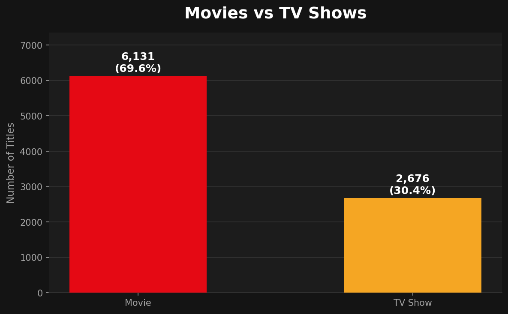
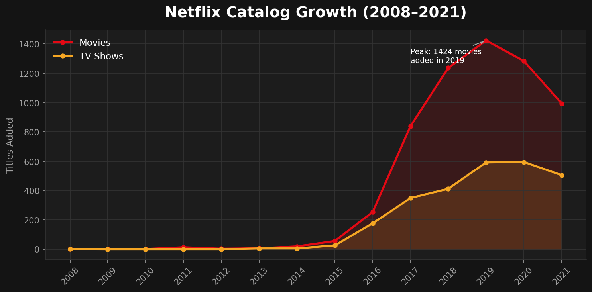
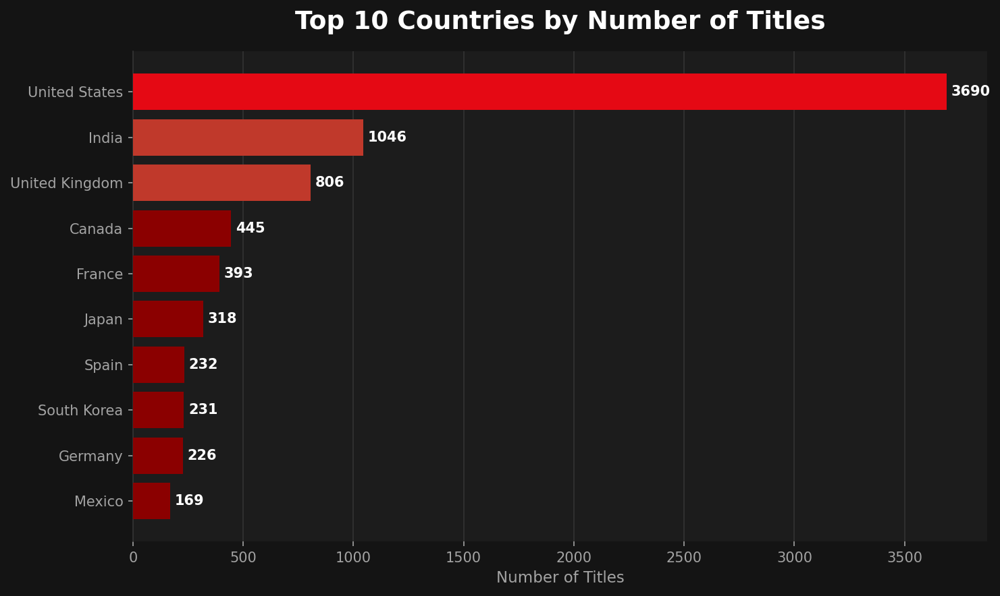
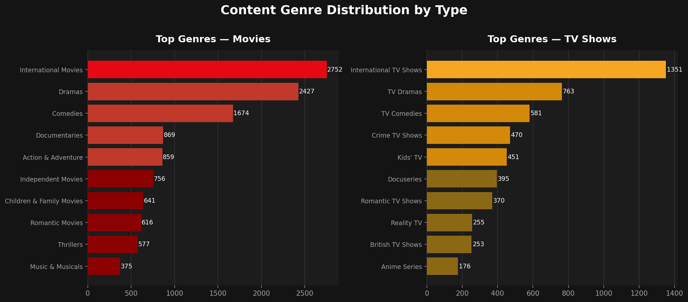
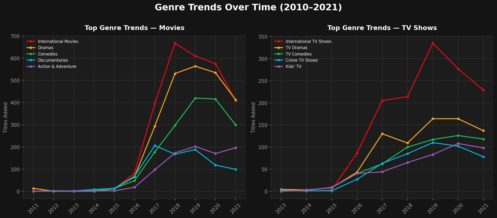

# Netflix SQL Content Analysis

Exploratory and temporal SQL analysis of Netflix catalog data (2008–2021) using Google BigQuery.

---

## Key Findings

### 1. Movies dominate the catalog — but TV Shows are catching up



Netflix catalog is heavily movie-focused: **6,131 Movies (69.6%)** vs **2,676 TV Shows (30.4%)**. However, the genre trend analysis reveals that TV Shows began growing at a faster pace after 2016, suggesting a strategic shift in content investment.

---

### 2. Catalog growth accelerated sharply between 2016 and 2019



Netflix added content at a relatively slow pace until 2015. From 2016 onward, both Movies and TV Shows grew rapidly — with Movies peaking in 2019 at over 1,400 titles added in a single year. The 2021 data appears incomplete, likely cut off before year-end.

---

### 3. The US leads production, but international content is a key pillar



The United States accounts for the largest share of titles by a significant margin. India and the United Kingdom follow as the second and third largest contributors. Notably, when counting countries individually from multi-country collaborations (via UNNEST), international participation is even broader than raw counts suggest.

---

### 4. Drama and International content dominate both Movies and TV Shows



Dramas and International titles consistently rank as the top categories across both content types. Comedies rank highly for Movies, while Crime TV and Docuseries are prominent in TV Shows — reflecting different audience consumption patterns between the two formats.

---

### 5. International TV Shows started rising earlier than International Movies



The temporal genre analysis reveals that International TV Shows began growing earlier than their Movie counterpart — indicating that Netflix's global content strategy started with serialized content before scaling to films. Dramas remained the most stable category throughout the entire period.

---

## Conclusion

The analysis shows a clear strategic pattern in Netflix's catalog growth: the platform scaled aggressively from 2016 onward, with TV Shows and international content — especially International TV Shows — leading the expansion ahead of their Movie counterparts. Drama remained the most stable category throughout the period, suggesting it functions as a safe, consistent bet regardless of format or region.

Based on these findings, a content strategy team could:
- **Prioritize international TV Shows in new markets**, since this format showed earlier and more sustained growth than international Movies — suggesting it's a stronger entry point for global expansion.
- **Treat Drama as a stable core genre** to anchor the catalog, while using faster-growing categories (International, Crime TV, Docuseries) to capture new audience segments.
- **Monitor the post-2019 slowdown** in Movie additions to understand whether it reflects a deliberate shift toward TV Shows or an external constraint (production costs, licensing, etc.) — the dataset alone can't answer this, but it flags where to dig next with more recent data.

---

## Project Structure

```
netflix-sql-content-analysis
│
├── queries
│   ├── 01_initial_exploration.sql
│   ├── 02_content_types.sql
│   ├── 03_countries_collaborations.sql
│   ├── 04_temporal_analysis.sql
│   ├── 05_categories_genres.sql
│   └── 06_temporal_categories_analysis.sql
│
├── charts
│   ├── chart1_distribution.png
│   ├── chart2_growth.png
│   ├── chart3_countries.png
│   ├── chart4_genres.png
│   └── chart5_trends.png
│
└── README.md
```

---

## Queries Breakdown

- **01_initial_exploration.sql** — date format validation, date conversion tests, exploratory checks on temporal data
- **02_content_types.sql** — temporal growth analysis by content type (Movies vs TV Shows)
- **03_countries_collaborations.sql** — titles by country, international collaborations, country participation including collaborations
- **04_temporal_analysis.sql** — titles added by year
- **05_categories_genres.sql** — combined categories, separated categories using SPLIT and UNNEST, ranking of categories by frequency
- **06_temporal_categories_analysis.sql** — growth of Movie and TV Show categories over time

---

## Dataset

- **Source:** [Netflix Movies and TV Shows — Kaggle](https://www.kaggle.com/datasets/shivamb/netflix-shows)
- **Records:** 8,807 titles
- **Period:** 2008–2021
- **Tool:** Google BigQuery

**Known limitations:**
- Missing values in `director`, `cast` and `country` columns
- Mixed duration formats between Movies and TV Shows
- No viewership or popularity metrics
- 2021 data appears incomplete

---

## SQL Skills Demonstrated

- CTEs and subqueries
- Date parsing and temporal analysis with `SAFE.PARSE_DATE` and `FORMAT_DATE`
- String manipulation with `SPLIT`, `TRIM` and `UNNEST` for multi-value columns
- `GROUP BY`, `HAVING` and aggregation functions
- Data cleaning and null value investigation
- Exploratory Data Analysis (EDA) workflow
